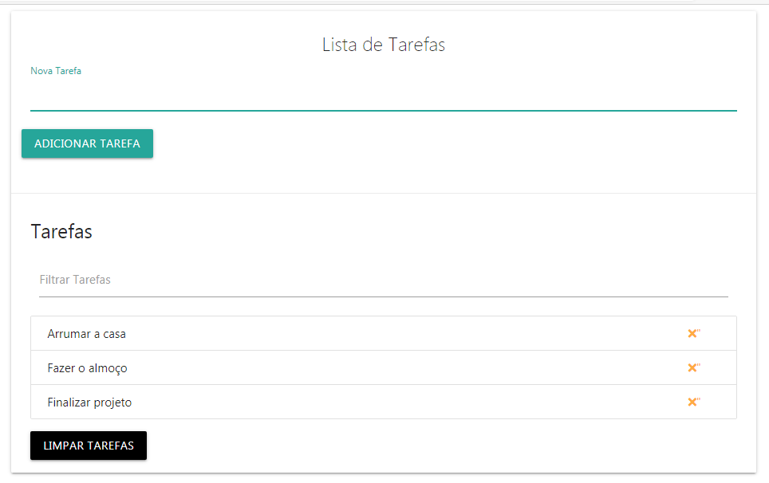

<h1 align="center">
  Task List JavaScript
</h1>

## 📋 Índice

- [Preview](#-Preview)
- [Sobre](#-Sobre)
- [Tecnologias utilizadas](#-Tecnologias-utilizadas)
- [Como executar o projeto](#-Como-executar-o-projeto)

---

## 🖥 Preview

  

---

## 📖 Sobre 

Exercício proposto para manipulação de DOM no curso "Modern JavaScript From The Beginning" do professor Brad Traversy. Neste exercício foi criada uma lista de tarefas sendo possível adicionar e remover tarefas da lista, também foi implementado filtro para a busca de tarefas dentro da lista, para o armazenamento da lista está sendo utilizado o próprio Locas Storage do navegador.

---

## 🚀 Tecnologias utilizadas
O projeto está sendo desenvolvido com as seguintes tecnologias:
- HTML5
- Materialize
- JavaScript

---

## ⌨ Como executar o projeto

Baixe o arquivo .ZIP do projeto e após descompactar abra com seu navegador o arquivo index.html.

---
